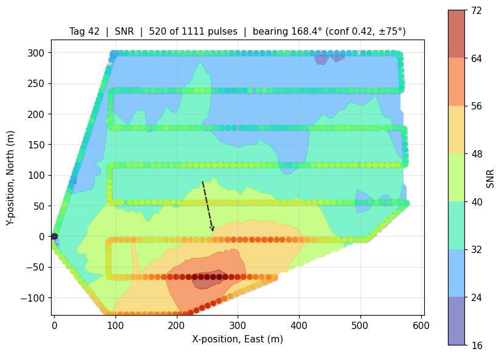

# pulseplotter (Python)

Plot UAV-RT pulse logs and export a KMZ for Google Earth. **No MATLAB required.**

A port of `pulseplotter2.m` from `../matlab/`. Same inputs, same
outputs, same numbers.



*This screenshot predates the 2026-09-02 layout rework: the controls are now
grouped into labelled sections, and the matplotlib toolbar sits between the
plot and the range sliders rather than on top of them. Worth retaking.*

## Install

You need Python 3.8 or newer **with Tk 8.6 or newer**. The only package
dependencies are numpy and matplotlib (3.6 or newer, for constrained
layout); `tkinter` ships with Python.

> **macOS: check your Tk version first.** Apple's system Tk is **8.5.9**, from
> 2010, and it is deprecated. The app will open a window and then paint almost
> nothing — no controls, no axes, no error. Apple's Xcode command-line-tools
> Python (`/Applications/Xcode.app/Contents/Developer/usr/bin/python3`) links
> against it, and a venv built from that interpreter inherits the problem.
>
> ```bash
> python3 -c "import tkinter; print(tkinter.TkVersion)"
> ```
>
> If that prints `8.5`, install a Python that bundles Tk 8.6 — `brew install
> python@3.12 python-tk@3.12`, or the installer from python.org — and build the
> venv from that interpreter **by full path**, because Xcode's python3 may come
> first on your PATH:
>
> ```bash
> /opt/homebrew/bin/python3.12 -m venv .venv
> source .venv/bin/activate
> python -c "import tkinter; print(tkinter.TkVersion)"   # must be 8.6
> ```
>
> Linux and Windows ship Tk 8.6 and are unaffected.

**Use a virtual environment.** It keeps these packages out of your system
Python, and on most modern systems a plain `pip install` will simply refuse to
run without one (`error: externally-managed-environment`).

### macOS and Linux

```bash
cd python
python3 -m venv .venv
source .venv/bin/activate
python -m pip install --upgrade pip
python -m pip install -r requirements.txt
```

### Windows

```bash
cd python
py -m venv .venv
.venv\Scripts\activate
python -m pip install --upgrade pip
python -m pip install -r requirements.txt
```

You will see `(.venv)` at the start of your prompt once it is active. That is
the whole point: everything installs inside `pulseplotter_py/.venv/` and
nothing else on the machine is touched.

> **If this folder is inside OneDrive, Dropbox or iCloud Drive**, put the venv
> somewhere else. A venv is about 79 MB across 2,839 files, and sync clients
> will happily upload every one of them, repeatedly. Create it outside the
> synced tree instead:
>
> ```bash
> python3 -m venv ~/venvs/pulseplotter
> source ~/venvs/pulseplotter/bin/activate
> python -m pip install -r requirements.txt
> ```
>
> Never commit or share the `.venv` folder — the recipient recreates it with
> the commands above.

**Every new terminal needs the activate step again** (just the `source` /
`activate` line, not the install). To stop, run `deactivate` or close the
terminal. To remove the whole thing, delete the `.venv` folder.

Verified on macOS with Python 3.9: pip resolves numpy 2.0.2 and matplotlib
3.9.4, and both test suites pass from a clean venv.

### If you would rather not use a venv

It will usually work, and installs into your user account rather than the
system:

```bash
python3 -m pip install --user -r requirements.txt
```

If that fails with `externally-managed-environment`, use the venv instructions
above rather than `--break-system-packages`.

### If tkinter is missing

`import tkinter` failing means Python was built without Tk. On macOS install
Python from python.org rather than using the Xcode/system one; on Debian or
Ubuntu `sudo apt install python3-tk`; on Windows re-run the installer and tick
"tcl/tk and IDLE". Note that `python3 -m venv` inherits tkinter from the Python
that created it, so fix the base Python first, then recreate the venv.

## Run

With the venv active:

```bash
python pulseplotter.py
```

Or without activating it, by calling the venv's Python directly:

```bash
.venv/bin/python pulseplotter.py
```

Optionally pass a log to open straight away:

```bash
python pulseplotter.py /path/to/Pulse-2025-11-21-11-08-41-149.csv
```

Then: **Load Data** → pick a `Pulse-*.csv` → the plot appears → **Export KMZ**.

## Using it

| Control | What it does |
|---|---|
| **Tag ID** | Which tag to analyse. Defaults to the most common one in the file. |
| **Axis** | Local metres (`x, y`) or degrees (`Lon, Lat`). |
| **Property** | What to colour and contour: SNR, STFT score, time, or altitude. |
| **Smoothing** | Moving-mean window over the property, in pulses. 0 or 1 disables. |
| **Grid Res. (m)** | Interpolation grid spacing. Coarsened automatically if a fine grid over a long flight would be too slow. |
| **Elev (m)** | Takeoff elevation, m MSL. Added to the relative pulse altitudes when writing KML. |
| **Plot Property** | Show the interpolated value, or its divergence. |
| **Tag Lat / Lon**, **Plot Tag** | Draw a known tag position for comparison. |
| **Time / SNR sliders** | Two sliders each, a lower and an upper bound. Replots on release. |
| **Active Bearing** | Save the current bearing into one of three slots to compare across flight segments. |

The plot title carries the bearing, e.g.
`bearing 168.4° (conf 0.42, ±75°)`.

- **bearing** — compass degrees, 0 = north, clockwise.
- **conf** — 0 to 1. How much the SNR gradient agrees on a direction. 1 means
  every grid cell points the same way; near 0 means the field has no consensus
  and the bearing is not meaningful.
- **±** — circular standard deviation.

Low confidence is information, not a bug. It usually means the flight did not
sample enough of a gradient to localise the tag.

## Exported KMZ

Opens in Google Earth with three folders:

- **`<property>` surface** — the interpolated field as a semi-transparent
  raster, transparent outside the area actually flown.
- **Contour lines** — switched off by default; tick it to see level curves.
- **Pulses (tag N)** — one marker per pulse, coloured by the property, with the
  value in its balloon.

Everything is self-contained: no images are fetched over the network, so the
KMZ renders correctly offline in the field.

## Files

| File | Purpose |
|---|---|
| `pulseplotter.py` | The GUI. Run this. |
| `readpulsetable.py` | Reads any TagTracker pulse-log format. |
| `geodesy.py` | Geodetic ↔ local ENU. |
| `analysis.py` | Smoothing, gridding, bearing estimator. |
| `kmzwrite.py` | KMZ writer. |
| `test_core.py` | Checks for everything except the GUI. |
| `test_gui.py` | End-to-end check through the GUI, window hidden. |
| `test_layout.py` | Layout audit at a range of window sizes. |
| `diagnose_gui.py` | Prints the widget tree with its geometry. For debugging a window that renders wrongly. |

The four modules below `pulseplotter.py` have no GUI dependency and can be
imported on their own:

```python
from readpulsetable import read_pulse_table
table, warning = read_pulse_table("Pulse-2025-11-21-11-08-41-149.csv")
print(len(table), table.snr.mean())
```

## Pulse log formats

TagTracker has shipped four header variants of the same file. The reader handles
all of them, because in every one the first 16 fields of a pulse record are in
the same order and columns 14/15/16 are latitude/longitude/altitude — so it
parses positionally rather than by column name.

It also drops the 4-field rotation start/stop records that are interleaved in
the full pulse log. A naive CSV reader turns those into "pulses" carrying a
latitude in the tag_id column, which corrupts the tag list and the plot origin.

You do **not** need to hand-edit the leading `#` out of the header, unlike with
MATLAB's `readtable`.

## Tests

```bash
python test_core.py
python test_gui.py
python test_layout.py
```

Both print a PASS/FAIL line per check. They use real logs from
`FLIGHT_TESTING_DATA` when reachable and fall back to synthetic data otherwise,
so they work on a machine that only has this directory.

`test_layout.py` builds the real window at five sizes, from the enforced
minimum to deliberately below it, and checks the geometry Tk actually
produced: every widget got at least the size it asked for, nothing extends
past the edge of its parent, no two widgets sharing a parent overlap, and the
control column grows a scrollbar rather than losing its bottom rows. Tk
silently hands a widget less room than it needs instead of raising anything,
so this is the only way to catch cut-off text and controls drawn over each
other short of looking at the window.

What the other two cover: all four log formats including rotation-row rejection;
`movmean` matching MATLAB's window convention exactly; geodesy agreeing with a
rigorous ECEF transform to under 5 cm over a 1 km box; the bearing estimator
being exact on synthetic fields with known answers and its confidence decaying
with noise; grid-size capping; and KMZ structure — well-formed XML, no dangling
style references, correct `LatLonBox`, no external references.

## Checking it against the MATLAB version

Load the same file in both and compare the title. On
`Pulse-2025-11-21-11-08-41-149.csv`, tag 42, defaults (SNR, smoothing 6,
grid 5 m, full time and SNR range), this version reports:

```
Tag 42 | SNR | 520 of 1111 pulses | bearing 168.4° (conf 0.42, ±75°)
```

MATLAB should agree to within rounding. If it does not, the likely culprits are
a different smoothing window or grid resolution rather than a porting error.

## Differences from the MATLAB version

- The time and SNR ranges are two separate sliders each rather than one
  two-handled slider; Tk has no native range widget. Their current bounds are
  printed beside them, where the MATLAB version has read-only Start Time and
  End Time fields in the control column instead.
- A matplotlib toolbar is included, so you can zoom and pan, which the MATLAB
  version cannot do.
- Plot Tag is a checkbox rather than a slider switch; Tk has no switch widget.
- The KMZ export writes directly rather than going through a temporary `.kml`.

## The window

The control column is a fixed 262 px wide, so a long file name cannot widen it
and squeeze the plot, and it scrolls when the window is too short rather than
hiding the controls at the bottom — the same thing `GridLayout.Scrollable`
does in the MATLAB app. The window will not resize below 900x560; at that size
everything still has its natural size except the plot, which is the only part
that gives up space.

If you change the layout, run `test_layout.py` afterwards. Tk does not warn
when a widget will not fit; it just draws it smaller, or not at all.

The numbers are the same.
